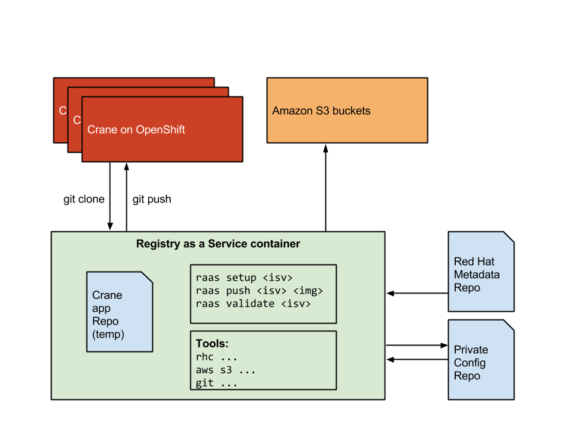

# Challenge
How to manage many git-based openshift registries from a single tool.



## Common configuration items
* crane application repository, i.e. https://github.com/pulp/crane
* OpenShift cartrige, i.e. python-2.7
* URL of Red Hat mask layers
* Default pulp server URL for exported content, i.e. https://pulp-server.example.com/pulp/static/
* Default OpenShift URL, i.e. https://openshift.redhat.com
* Credential tokens for AWS and OpenShift

## Per Registry configuration items
* OpenShift domain
* Registry FQDN for `docker pull ...` validation
* AWS S3 bucket name

## Operation
The raas CLI tool runs within the context of the specific Crane instance git repository. This should be a stateless container with the following configuration:

* [OpenShift client](https://access.redhat.com/documentation/en-US/OpenShift_Online/2.0/html-single/Client_Tools_Installation_Guide/index.html#sect-Installing_Client_Tools) `rhc` installed
* AWS client tools installed
* git
* raas CLI tool

## Layout

### Configuration Repository

The `raas` tool is designed to get its state and configuration from a private configuration repository. The SSH read+write repo URL must be defined as environment variable "RAAS_CONF_REPO". For example `RAAS_CONF_REPO=ssh://<user>@gitrepos.example.com:22/raas.git` or `RAAS_CONF_REPO=git@github.com:<user/raas.git`.

The config repo keeps logs and a backup of the crane metadata files from the OpenShift application.

```
/path/to/config
.
├── raas.cfg
├── crane-releases
│   └── crane-python-crane-0.2.2-1.tar.gz
├── redhat
│   └── metadata
│       ├── rhel6.json
│       ├── rhel7.json
│       └── ...
├── <isv1>
│   ├── logs
│   │   ├── yyyy-mm-dd.log
│   │   └── yyyy-mm-dd.log
│   └── metadata
│       ├── app1.json
│       ├── ...
│       └── appN.json
├── <isv2>
│   ├── logs
│   │   ├── yyyy-mm-dd.log
│   │   └── yyyy-mm-dd.log
│   └── metadata
│       ├── app1.json
│       ├── ...
│       └── appN.json
├── <...>
└── <isvN>
```

### raas.cfg

The ISV sections match the raas CLI argument.

```
[redhat]
metadata = http://example.com/path/to/redhat/metadata/

[openshift]
server_url = https://openshift.redhat.com
app_git_url = https://github.com/pulp/crane
username = my_name
password = changeme
cartridge = python-2.7

[isv1]
s3_bucket = isv1.bucket
openshift_domain = isv1
openshift_app = registry


[isv2]
s3_bucket = isv2.bucket
openshift_domain = isv2
openshift_app = registry

```

## Conventions

* AWS S3 bucket name: ISV determined
* OpenShift ISV domain name: ISV determined
* Default OpenShift application name: "registry"
* AWS S3 images path: `https://s3.amazonaws.com/<isv_bucket_name>/<openshift_app_name>`
* Pulp repository name: Replace "image/name" with "image-name" and prepend ISV domain, e.g. `<isv_domain>-<image-name>`
