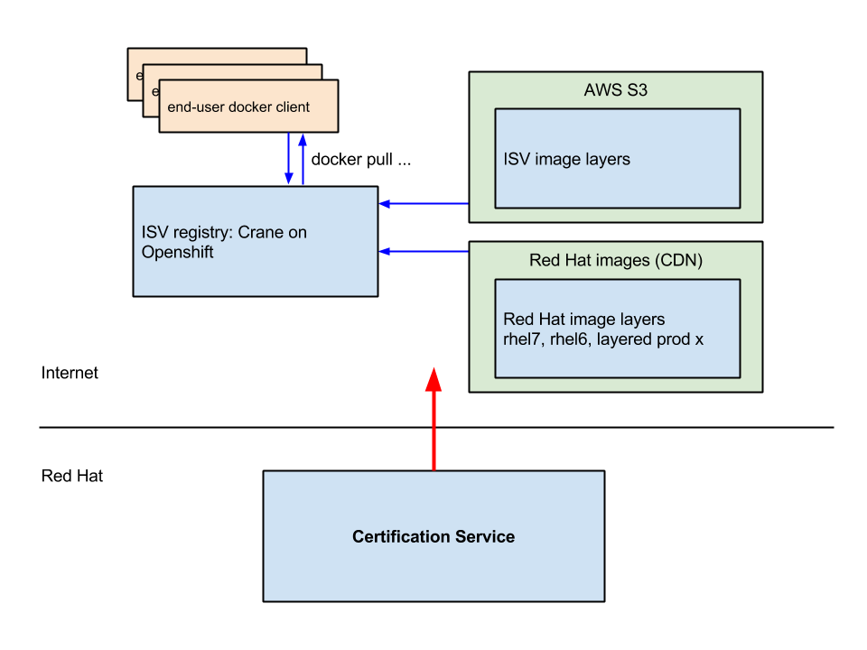

# Docker Registry as a Service

A docker registry service in the cloud that integrates with Pulp and the Red Hat ecosystem. Using a Pulp server the service deploys docker image layers to cloud storage (AWS S3) and OpenShift (Crane).

## Basic Idea



## Workflow
Below is a typical use of the `raas` tool. The following global options may be used:

* Set configuration branch: `--configenv dev|stage|master` This is an important feature of `raas`. This enables the user to seemlessly switch between environments that are configured and managed completely separate from each other.
* Set log level: `--log DEBUG|INFO`
* Disable commiting configuration after tool runs: `--nocommit` This is typically only used in development.

### Upload image to pulp server

**Prerequisites**

1. access to a pulp server
1. a saved docker image: `docker save <some/image> > some-image.tar`

```
raas pulp-upload <isv> <some/image> some-image.tar
```

* creates pulp repository for docker content if it doesn't exist
* uploads local tar file

### New setup

**Prerequisites**

1. Create an OpenShift domain
1. Create an empty AWS S3 bucket with read+write permissions.

```
raas setup <isv>
```

* Validates openshift domain
* validates AWS S3 bucket access
* creates Crane registry as an OpenShift gear
* validates registry at `/v1/_ping`

### Publish or update an image

**Prerequisites**

1. Setup has been run
1. An image has been uploaded to the pulp server

```
raas publish <isv> <some/image>
```

* Clones deployed openshift crane repo
* downloads image from pulp
* pushes ISV layers to S3
* gets RH metadata
* adds ISV metadata
* git commit, git push to OpenShift

### Status

```
raas status <isv> -a <some/image> --pulp
```

* Checks domain is present
* checks S3 bucket is present
* clones deployed openshift crane repo `rhc clone ...`
* gets deployed image list
* pulls S3 image list
* validates lists match
* checks crane registry API `/v1/_ping`

## Troubleshooting

The container packaging of this tool has additional troubleshooting tools installed.

1. `[sudo] docker pull aweiteka/raas`
1. See below for docker run command.
1. Use the command-line tools to inspect the system.
    * Run diagnostics: `raas --log DEBUG status ...`
    * List AWS S3 resources: `aws s3 ls s3://mybucket --recursive...`
    * Run OpenShift CLI: `rhc ...`
    * Inspect configuration repo: `git clone ...`

## Installation

**Requirements**

* Python 2.6 or 2.7
* AWS S3 account
* OpenShift account
* Private repository of credentials and other configuration


1. Clone this repository: `git clone https://github.com/aweiteka/raas.git`
1. Install Python dependencies: `pip install -r requirements.txt`
1. Make the script executable: `chmod +x raas.py`
1. choose configuration option (below)
1. run tool as `./raas.py ...`

### Configuration

There are two ways to manage the configuration of the environment. To use a local configuration, run `raas` from the directory where the `raas.cfg` directory.

#### Remote

1. Set environment variable of read+write private repository, for example `export RAAS_CONF_REPO="git@github.com:user/private-raas-config.git"`

#### Local (development only)
Run `raas` from the directory where the `raas.cfg` directory.

1. Copy config file `cp raas.cfg.template raas.cfg`
1. Edit `raas.cfg` config file.

## Running as container

Instead of running on a dedicated host, the raas tool is intended to be run as a container. State is maintained by the configuration repository. In this way multiple users, including automated processes, can use raas to manage and troubleshoot the registry without workstation dependencies.

```
[sudo] docker run -it --rm \
              -e RAAS_CONF_REPO="ssh://user@git.example.com:22/private-raas-config" \
              -v ~/.ssh/id_rsa:/root/.ssh/id_rsa \
              -v ~/.ssh/id_rsa.pub:/root/.ssh/id_rsa.pub \
              aweiteka/raas
```
This provides access to `raas`, `aws`, `rhc` and `git` tools. You may need to edit `~/.openshift.express.conf` to add your username for the `rhc` client to work.

